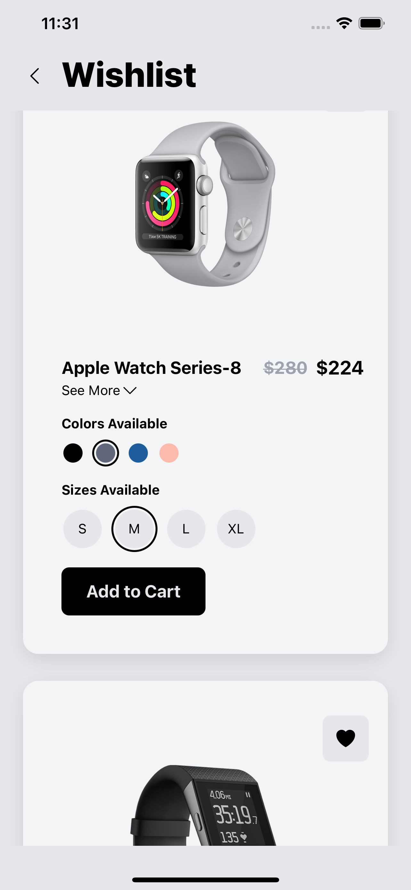

# firebeats
# Fitness Tracker E-Commerce Application

## Table of Contents
- [Introduction](#introduction)
- [Features](#features)
- [Technologies Used](#technologies-used)
- [Screenshots](#screenshots)

## Introduction

Welcome to the Fitness Tracker E-Commerce Application GitHub project! This is a React Native-based application designed for selling fitness trackers. The app enables users to browse a variety of fitness trackers, sort them by price, add products to their Wishlist, and purchase them through an integrated Stripe payment system.

## Features

- User authentication using Firebase and Google Cloud.
- List of fitness trackers sortable by price.
- Wishlist functionality to add/remove products.
- Product customization (color and size) before adding to the cart.
- Cart screen displaying the selected items.
- Stripe integration for secure and easy checkout.
- ExpressJS backend with a router to obtain the Stripe client secret key.
- User profile view to track orders.

## Technologies Used

The project is built using the following technologies:

- React Native: For creating the mobile application.
- Firebase: For user authentication and database storage.
- Google Cloud: For additional authentication methods.
- Stripe: For secure payment processing.
- ExpressJS: For creating the backend server.

## Screenshots

  
  
  
  
  
  
  
  
  
  

